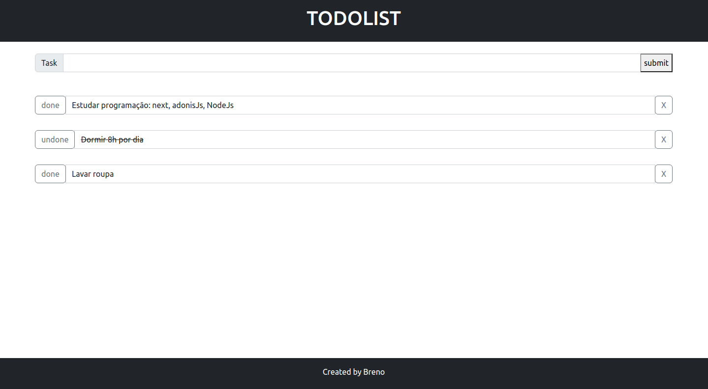

# Todolist ✅​

## 👀 Como ficou ???

</img>
----------

## 🧑‍💻 Tecnologias usadas

O projeto foi desenvolvido com as seguintes tecnologias:
- [TypeScript](https://www.typescriptlang.org/)
- [Nodejs](https://nodejs.org/en/docs/)
- [AdonisJS](https://adonisjs.com/)
- [Bootstrap](https://getbootstrap.com/)
- [Postgresql](https://www.postgresql.org/)

## ⌨️ Sobre o projeto

O projeto consiste num todolist ou seja, uma lista de tarefa, utilizando o framework AdonisJS, utilizando banco de dados PostgreSQL e para estilização Bootstrap
## `npm install`

É necessário dar um "npm install" ou "npm i", para instalar as depêndencias do projeto.

## Rodar o projeto

Primeiramente é necessário ter o node, caso não tenha faça a instalação dele. [NODE](https://nodejs.org/en/download/);
Necessário ter um banco de dados sql, criar um database;
Também fazer as alterações adequadas no arquivo .env;
`node ace migration:run`

## `npm start`

Depois de ter instalado as dependências, basta dar um "npm run start-dev", para rodar o projeto em modo desenvolvedor. Abra [http://localhost:3333](http://localhost:3333) para vê o projeto em seu navegador.